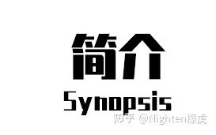

# \[0-1\]多重人格手册·宣言与简介

## 

多重人格或人格分裂，身边的人大都知道。  
在电影中，在小说里，人们看到这样一种现象。  
普通人对其望而生畏，或对其兴致盎然。  
“有多个人格在体内是怎么样一种体验？”他们问道，“人格之间会谈恋爱吗？”  
医师对其时而持有怀疑态度，  
“多重人格啊，这东西不怎么存在的。”  
“有这种情况的人一定都是痛苦的，别像看戏一样。”  
..\. ...  
身边的人也打趣地和我说，“哎呀你看这老师一会脾气贼好，一会又大骂出手——你说，他是不是精分了呀！诶你你你说说看嘛！”  
“\*”，虽然我知道精分是精神分裂的缩略词，但对于大众那些人来说，我也不能发火。我能做的一件事儿，是MMP微笑\(\*￣︶￣\)。

不过，我最近才开始系统地去接触，和了解这一类群体：  
“人格一词，对他们来说，是残忍的。因为这个词否定了他们作为自我的存在。于此同时，它招致了大众对其的误解。”  
“主人格嘛，它也不一定存在的，那种天生的多重人格虽然少见，但有么还是有的。”  
“原来，健康而快乐的多重人格情况存在，而且居然还不少？所以DSM-5中加入了招致痛苦的诊断标准呢！”  
“解离性身份障碍？DID？什么时候一个一个的人变成身体的身份了？还有那什么，强制让病人整合？嗯？这什么外表光鲜内心破落的事儿？只有12.5%在十年之后仍然保持成功整合？”

“嗯..\. ...”  
观察这样的一个一个案例，文章如雪一般堆积起来。它堆在我的脑子中，时刻闪着光，让我写，让我去诉求。虽然我的心理咨询水平并不好，但是，我能理解。对患者而言，疾病应当是痛苦的。我们应当让“他们”感到舒服，而不是为了“变成正常人”。  
“正常”变成了一些医师的口癖，似乎成为了一个正常的人，才是没有疾病的，才是健康的。但是谁喵的说高智商这东西是一种疾病？他们和普通人群也早已相去甚远！  
和多重人格一样，这些名词，都是人类神经多样性的体现。有这些丰富而多元的人类存在，世界才变得丰富而有趣。

因此，多重人格——不是“人格”，“性格”，或“身份”、“角色”，他们每一个个体都是独立而鲜活的生命！任何人都应当尊重别人想要保持自己存在的愿望。而不是去整合他们。整合他们，只会让他们看起来正常一些，但是同样也不是最佳的方式。  
多重人格社区里，各种各样的文章，都在诉求尊重与理解。  
我点进去的许多文章，都在反对整合。“凭什么我要为了正常而牺牲自己的个性？”“我所想要的，只是——好好活着。”“那些整合的狂热分子又来了，哼！”  
更有甚者，他们在个人网站上，刊登了“如何假装自己变成了正常人？”  
嘿，不得不说，他们的想法确实很有趣，也值得一读。但是他们也指出了一个问题：  
医师的这种整合，对他们来说，是不给选择的，这不像治疗，更像谋杀。

谢谢你们看到这篇手册。这只是我的一个小小的心愿。我只是希望，我能用我一个人绵薄的力量，让科学和知识走进大众与医师在国内的视野。因为，误解带来伤害，而知识带来的，才是对他们真切的关爱。

## 

多重人格手册是为有多个意识体内身体内的人，医师、和向普通人科普而写的，预计今年寒假完成手册主干部分。里面主要讲述了多重人格相关的知识，而且会以一种尽可能科学严谨的态度去陈述  
在这篇多重人格手册里，你们将会看到另一个词语：多意识体。使用这一词，代表我对他们的尊重。我目前没有多重人格，因此我可以更以一种中立的态度去分析，阐明他们的观点。  
我希望你们通过手册了解，多意识体在脑中的生活，也是很丰富的。比如说他们内在的交流，另一个他们用想象建构的世界，他们的交换，附体。他们的自我认同，每个系统成员之间的关系，系统成员之间的职责。  
可以说，在他们心中，有一个小小的，独属于他们的世界。这个世界和现实一样，都有各自独立的分工。  
它也是相当复杂的，因为它囊括了性别认同，身份认同，系统的来源，由于错综复杂。每一个意识体可能会有不同的心理状态，精神疾病。光是这些自我认同大约有上百个，系统来源大约150多种，职位大概150种。  
这是目录：  
\* 0-1 ：宣言  
\* 0-2 ：收录网址  
1-1 ：历史及发展，医学+社区简述  
\* 1-2 ：道德标准  
\* 1-3 ：基础词表+词汇导图  
\* 2-1 ：多意识体的组织方式+Median+Subsystem+Polyfragmented  
\* 2-2 ：Emmengard分类  
\* 2-3 ：Parogenic基础  
\* 2-4 ：Traumagenic基础+谱系  
\* 2-5 ：临床诊断标准  
\* 3-1 ：技巧  
\* 3-2 ：幻境基础  
\* 4-1 ：自我认同  
\* 4-2 ：人格职责  
5-1 ：学科关联（宗教，心理）  
5-2 ：疾病相关  
5-3 ：常见问题回答
 
其中，\*代表的是重要内容，会提前写。后面代表的是手册的顺序。

## 

注：如果你想保持身份匿名不被攻击的话，请看到之后立刻通知我这些消息。  
这篇多重人格手册目前独立由本人完成。暂且不收录其他内容（未来很可能会收录的）。  

感谢：  
票君 @嗯我也不知道 让我进入了tulpa社区，从此开启了一条绝非容易，但是特殊的路。  
感谢Vario系统 @Vario Dreams 对B站视频、本手册修改上的意见，包含对词汇表的译名问题。  
感谢TheaceaeMRSTC系统 @TheaceaeMRSTC 所提供的网址。  
感谢Simplex系统 @simplex3 给予的一些关于目录的提醒，已经修改。  
感谢好人III（可能还有lyra） @Goodman3 在圈内传播为bilibili讲座  
感谢李明哲为bilibili多重人格讲座提供的资金（但是这明明是我设计证书的费用啊）[多重人格讲座\_哔哩哔哩\_bilibili](https://link.zhihu.com/?target=https%3A//www.bilibili.com/video/BV1Ga411m7Ld%23reply100135772704 "制作文件版的时候能不能把链接修一下去掉知乎套的那一层……")  
感谢Simplex系统 @Simplex3 所提出的目标与愿景——让更多的DID患者得到妥善治疗，我会在这方面尝试寻求突破的  
感谢兰术士系统 @Pilgrim-749 所指出的关于目录的小问题。  
