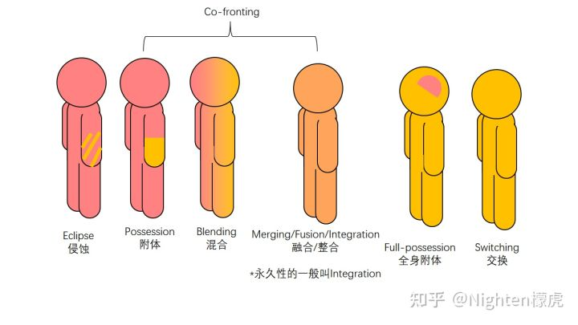

# \[3-1\]多重人格手册·技巧

多重人格（人格分裂）手册的各类技巧。  
写于：2.07，改于：2.09

**注：由于我是Tulpa社区来的，所以这篇文章我主要接近T圈的术语。如有问题，请指正，谢谢。**  
\*\*\*\***警告：里面有触发词，如果你出于某些原因，会因为某些词汇触发闪回等退缩症状，请谨慎阅读本文**\*\*\*\*

3里面主要讲一些各种各样的技巧。这一章主要介绍一些和肢体有关的技巧（还有别的）。

1. 肢体相关  
	  
	可以从图片里看到，“粉色”代表其中的一个人，“金色”代表另外一个人。从左到右，是“替代性”越来越强的过程。  
	最左侧叫侵蚀（Eclipse）。在每一个意识体能相互交流的情况下，后台的一个人指唤前面的人去做什么。这种情况叫侵蚀。  
	中间的三个都叫做Co-fronting，也就是共同主导，意味着共同地在前方掌控身体。  
	第一种情况叫附体，即后台的人掌控前台人一部分的躯体的现象。可能是一只手，一个脑袋，一张嘴，或者双腿，更大面积的。这种方式下，这部分的躯体会出现像癔症的症状——但是它完全可以不是病理的。有些人描述过这样的感觉：这部分的肢体麻木了，并且我难以去控制它的动作，同时，这里碰到的地方触觉没有那么敏感。但是我没有感到任何的异常——仿佛它就在那里做着这样的事，一切正常。  
	第二种情况叫混合。当多个意识同时附体的时候，他们的身份可能会出现轻度的混淆。这种情况下，有些部位可能模糊地感觉有两个人控制，或多个。它是不完全分离，但不完全融合的情况。  
	第三种情况其实分为短期和长期的。  
	他们的情况总体来说，指的是融合起来成为一个全新个体的情况——原本的两个意识体的思路融合在了一起，共同决策。他们的感受是，我中有他，他中有我。“我”的自我认同和躯体的感觉可能会有所变化，可能感觉身上变得毛茸茸的，头上长角这类，或者性格更为温和强大。  
	根据Pluralpedia，Merging，Fusion和Integration代表的是相同或相近的意思，只不过前者更经常在Tulpa社区使用，后两者在多意识体社区使用，常常指的是较为永久的情况。  
	总之，在中文里，使用“融合”代指短期的意识体结合在一起的情况，而“整合”指的是长期、甚至是永久的情况。  
	在系统规模比较大的时候，常会有融合或整合出现——这样做，有可能是为了让整个系统内部的结构稳定下来的方式。**然而，一些系统在成员没有同意的情况下强制他们融合在一起。这被认为是不人道的，而且往往是来自外部事情，特别是医生或其他系统的压力的结果。对系统的其他成员来说，突然的融合可能感觉像是家人或朋友的突然死亡。**  
	请注意，虽然我呈现的是两个人在身体前方的情况——但是对融合、整合来说，可以在后台/幻境里发生。在前台的时候，相当于他们成为了一个全新的人，然而，他仍然会感觉自己由两个人组成，但只有一个人的身份让他们感到自己更像Median system，也就是半多意识体的情况（一般较强，靠近多意识体的区域）。  
	Full-possession指的是全身附体，但是这一术语更像Tulpa社区内用于指代交换中的过程（似乎只在其中可以观察到）。在这个时候，另一个意识体虽然掌控着整个身体的运转，但是原来的意识体仍然能够收回对身体的整体掌控权（也就是那个脑子的象征含义）。  
	注：我不清楚Full-possesion是否属于共同主导的范畴——我个人的理解是不是，所以把它区分开来了。

2. 幻境  
	幻境相关的内容会在后一章单独写完。

3. 分裂Split  
	分裂指的有几种。  
	第一种情况说的是Split，也就是分裂。它通常指的是一个系统成员因为外部的压力而碎裂成多个的情况。比如说暴力，校园忽视。  
	（该词在BPD边缘性人格障碍的区域内暂时在本文忽略）  
	第二种可能的分裂指的是某些性格上的丢失。这一次可能叫做Shard-feeding。即一个人的意识中碎出了小块，而这些小块被其他意识体吸收的方式。吸收之后，这个人的性格、做事行为可能会很快发生改变。  
	这种方式可能用于对某些过于恶意的个体的性格控制。

4. 描绘类  
	描绘类指的是一系列与“想象”这一行为相关的技能。  
	多数人们会在脑海里想象出充满色彩的图案，这一技能可以称作想象（Imagination），也可以被称作描绘（Visualization）。想象出来的图案或者声音等东西则在心理学上被称作心像。  
	这一技能是可以被练习的，尤其是在想象内在空间/内在世界/幻境的时候——它可以从不稳定到稳定，也可以从图案是模糊的到更为精细，从只能看到一小片区域到一大片的区域。（作者理解）  
	下一项技能叫叠置（Overlay），也就是在现实中想象某处有“实体”存在的描绘方式——（个人理解）这一方式可以作为投影的基础。  
	投影（Imposition）是一种将内心的想象东西作为“假性幻觉”想象到现实生活中的方式。其是一个人主观能控制的，并且能做到什么程度取决于消耗注意力和脑力的多少。这被整个多意识圈视作一种非常推崇的能力。  
	请注意，投影在大多数情况下是需要刻意练习才能获得的，而其练习时长常常以年计算。它是一种可控的、目前没有看到危险性的幻觉——与精神分裂症/妄想等不同。它可以用于不同的感官，从触觉、嗅觉、听觉、味觉到视觉都可以练习，一般最难的是视觉。有些人认为，之前有认知功能损伤或出现过幻觉的人更容易练习。  
	再者，也有一部分人可能天赋异禀，也就是说天生具有投影的能力。这部分人相当少，但是存在。（于是乎他们经常成为了我认识的人嫉妒的对象hhh）。据说，特斯拉很可能具有掌控投影的能力。

5. 精神类  
	这是笔者提出的新分类模式，通过观察，我认为控制精神的情况是完全有可能的，应当单独列出一种能力。  
	既然意识体在后台的时候，其更接近于“他们”本身，所以很多意识体具有某些精神上的能力。  
	有研究和许多案例报告了不同的多意识体有不同的天赋，从艺术到运动方面不等。有些人猜测，这可能是由于不同 的神经元连接，或者信号的传递方式导致的，但这方面的研究缺失，没有假说可以证实。  
	对于精神病而言，有些意识体报告说，他们的情绪可以在爆发的时候被其他意识体发现，并得到恰当的控制。由于经常情况下每一个意识体的精神疾病状况不同，所以对精神疾病做到一定的控制是完全可能的。如精神分裂的幻觉可以被控制，当强迫症发作的时候进行的强制交换可以保护躯体，对阿斯伯格综合征的“非黑即白”思考模式的多样化等，都可能是多意识体的能力。再者，很多能表现出对“痛苦”感觉的屏蔽，也就是多个意识体有可能都不疼，但是躯体是有痛苦的情况。  
	也有人发现，在梦里，其他的意识体能与他互动，有时候，他们的梦境是独立的，有时候是在一起的——于此同时，当有人做了梦魇时，其他意识体可能有能力把噩梦驱走。  
	此外，由于多意识体接触到的记忆的不同，意识体A可以让意识体B把某些“记忆”封藏起来，通过在意识空间里做一个象征物“箱子”，然后把记忆象征性地放进去的方式。这些象征物的手法可能是常用的对各类精神实体的控制方法。

6. 休眠/封存  
	休眠一般指的是一个意识体短暂或长期的进入“睡眠”或者“不活跃”的模式。要做到这一点，一个意识体是在幻境中放空身心，把想法等方式排除出去。当受到外界刺激，或自身觉得有足够的能量，或时机恰当时，它们便会醒来。  
	这一方法一般对多意识体并不危险，但是可能会削弱他们的活力。在一个意识体取得意识或知觉之前，也可能是在这种状态。意识体将这种状态认为是“无梦的眠”——这一点笔者认为和人死亡后的感知状态类似。  
	封存这一方式则是被动的，一般针对恶意的意识体而产生——让他不能出来活动的方式可以解决问题，当然沟通更好。

7. 抹杀（Killing）  
	\*警告：这一方式相当极端，在使用前请慎重考虑！  
	一个成熟的意识体并不会轻易地那么离开。不过抹杀一般是由更强大的系统成员对更虚弱的系统成员做的事件。一般是出于极为棘手的问题。这一做法通常给双方都带来很强的痛苦，因此慎重考虑。

参考资料：  
[http://tulpa.cn](https://link.zhihu.com/?target=http%3A//tulpa.cn)  
[Terms](https://link.zhihu.com/?target=https%3A//pluralpedia.org/w/Category%3ATerms)
