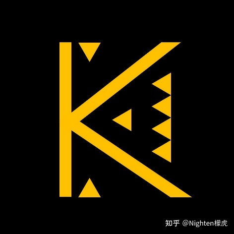

# 作者简介

作者是Nighten檬虎，知乎号：Nighten檬虎。可以叫我檬虎，英文的话叫我Nighten就行。目前（2022）为高三学生，目前在做乐理研究和多重人格研究。目前对多重人格的研究还在阅读相关材料的阶段，大约研究了1年左右。

这里欢迎各类意见和评论。我也会以尽可能科学严谨的态度去回复一个个的问题，恶意攻击除外。另外，感谢各位的关注。现在，这本手册真正开始撰写了。

联系方式：  
建议：QQ2077030038

其他：  
知乎——Nighten檬虎  
邮箱——dxfdxf2003@163.com  
Bilibili：Nighten檬虎  
QQ：1245599099/1459271838  
微信：wxid\_8eh52ds83p7s22

比较奇怪的联系方式：  
网易云：Nighten（音乐人）Nightenstar\(用户\)  
洛谷：Nighten  
猫武士世界：檬虎  
Tulpa.info: Nighten  
33iq: Nightenstar°/猫咪⊙ω⊙（建议）
