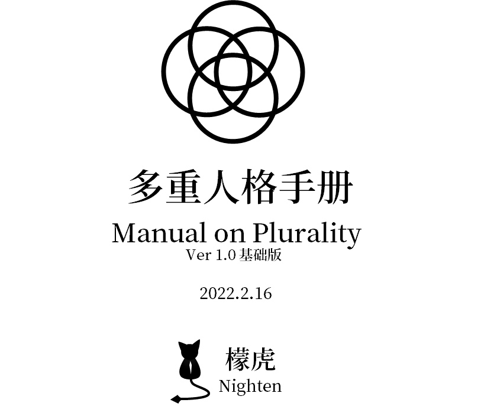

# 目录

- \[0-1\][多重人格手册·宣言与简介](01.md)
- \[1-2\][多重人格/人格分裂手册·道德标准​](12.md)
- \[1-3\][多重人格手册·基础词表​](13.md "等待记录")
- \[2-1\][多重人格手册·多意识体的组织方式​](21.md "等待记录")
- \[2-3\][多重人格手册·来源词汇表​](23.md "等待记录")
- \[2-5\][多重人格手册·适应型基础​](25.md "等待记录")
- \[2-6\][多重人格手册·临床诊断标准​](26.md "等待记录")
- \[3-1\][多重人格手册·技巧​](31.md "等待记录")
- \[3-2\][多重人格手册·幻境​](32.md "等待记录")
- \[3-3\][多重人格手册·小方法​](33.md "等待记录")
- \[4-1\][多重人格手册·身份认同​](41.md "等待记录")
- \[4-2\][多重人格手册·职责/角色​](42.md "等待记录")
- [作者简介​](author.md "等待记录")

# 版权声明

本手册内容**转载需要注明出处**（可以直接复制下面一段）。E.g.:  
参考资料：檬虎，多重人格手册\[J\]
 
本手册大部分资料不可被更改（防止信息错误、错乱），或者版权被认为为个人所有（防止矛盾）。作者声明，**此手册的知识应当公开，并且知识不为任何机构或个人所有**。  
若被更改，请前去以下下载链接查看原版：
 
【多重人格手册Ver1.0 -檬虎.docx】，点击链接查看<https://v2.fangcloud.com/share/ab0f674e138cc06b3a76f0ad1a>
